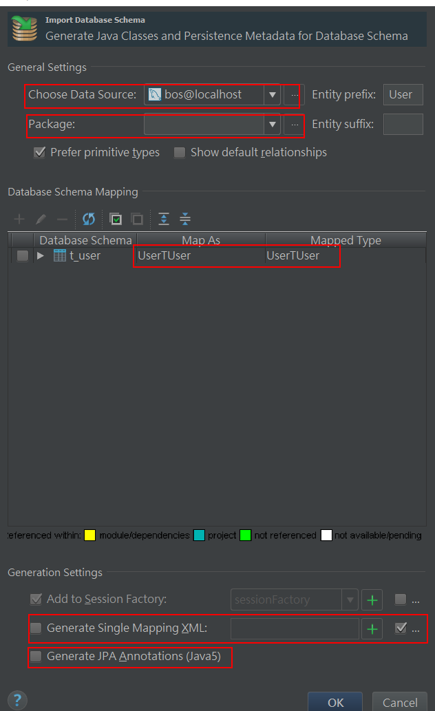

<!-- TOC depthFrom:1 depthTo:6 withLinks:1 updateOnSave:1 orderedList:0 -->

- [javaee-bos](#javaee-bos)
	- [文档说明](#文档说明)
	- [开发环境](#开发环境)
	- [技术选型](#技术选型)
	- [搭建开发环境](#搭建开发环境)
		- [数据库环境](#数据库环境)
		- [创建web项目](#创建web项目)
	- [持久层设计](#持久层设计)
	- [验证码](#验证码)
	- [struts2将所有错误信息配置到统一的文件中](#struts2将所有错误信息配置到统一的文件中)

<!-- /TOC -->thFrom:1 depthTo:6 withLinks:1 updateOnSave:1 orderedList:0 -->

# javaee-bos

## 文档说明

本项目的开发流程、核心技术等都会记录于此

## 开发环境

- 操作系统：Windows
- 开发工具：IntelliJ Idea
- 数据库：MySQL
- 容器：Tomcat

## 技术选型

| 工具 | 版本 | 说明 |
| -- | -- | -- |
| Struts2   | 最新 | a |
| Hibernate | 最新 | a |
| Spring    | 最新 | a |
| jUnit     | 最新 | a |

## 搭建开发环境

### 数据库环境

1. 创建数据库
`create database bos;`
2. 创建一个数据库用户
为了安全起见，不要用root用户
`create user ubos identified by '1111';`
3. 为创建的用户授权
`grant all on bos.* to ubos;`
4. 使用创建的用户登录数据库

### 创建web项目

1. 创建一个maven项目
2. 分别创建四个`maven module`，命名为:`web-app`,`web-service`,`web-dao`,`web-common`
3. 引入相关maven依赖
4. 配置web.xml,具体配置参考程序
5. 配置日志文件
6. 配置struts2文件
7. 配置spring文件

## 持久层设计

1. t_uer
	```
	CREATE TABLE bos.t_user
	(
	    id VARCHAR(32) PRIMARY KEY,
	    username VARCHAR(20),
	    password VARCHAR(32),
	    salary DOUBLE,
	    birthday DATE,
	    gender VARCHAR(10),
	    station VARCHAR(20),
	    telephone VARCHAR(15),
	    remark VARCHAR(100)
	);
	```
2. 在idea中使用hibernate反转引擎生成pojo和配置文件
	- 
	- 
	- 
3. BaseDao

## 验证码

1. jsp中
	```
	
	```
2. 生成验证码的页面
	```
	<%@ page language="java" contentType="text/html; charset=UTF-8"
         pageEncoding="UTF-8" %>
	<%@ page import="javax.imageio.ImageIO" %>
	<%@ page import="java.awt.*" %>
	<%@ page import="java.awt.image.BufferedImage" %>
	<%@ page import="java.io.OutputStream" %>
	<%@ page import="java.util.Random" %>
	<%
	    int width = 80;
	    int height = 32;
	    //create the image
	    BufferedImage image = new BufferedImage(width, height, BufferedImage.TYPE_INT_RGB);
	    Graphics g = image.getGraphics();
	    // set the background color
	    g.setColor(new Color(0xDCDCDC));
	    g.fillRect(0, 0, width, height);
	    // draw the border
	    g.setColor(Color.black);
	    g.drawRect(0, 0, width - 1, height - 1);
	    // create a random instance to generate the codes
	    Random rdm = new Random();
	    String hash1 = Integer.toHexString(rdm.nextInt());
	    // make some confusion
	    for (int i = 0; i < 50; i++) {
	        int x = rdm.nextInt(width);
	        int y = rdm.nextInt(height);
	        g.drawOval(x, y, 0, 0);
	    }
	    // generate a random code
	    String capstr = hash1.substring(0, 4);
	    session.setAttribute("key", capstr);
	    g.setColor(new Color(0, 100, 0));
	    g.setFont(new Font("Candara", Font.BOLD, 24));
	    g.drawString(capstr, 8, 24);
	    g.dispose();
	    response.setContentType("image/jpeg");
	    out.clear();
	    out = pageContext.pushBody();
	    OutputStream strm = response.getOutputStream();
	    ImageIO.write(image, "jpeg", strm);
	    strm.close();
	%>
	```

## struts2将所有错误信息配置到统一的文件中

1. message.properties
	配置所有信息
2. struts2配置文件
	`<constant name="struts.custom.i18n.resources" value="message"/>`
